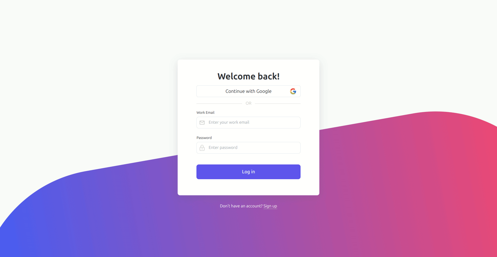

# Project Management App (Not completed)

This is a task and project management web application designed to help teams and individuals organize and track their work efficiently. The app includes features such as workspaces, spaces (projects), lists (tasks), and task statuses like "To Do," "In Progress," and "Complete."

## Technologies Used

This project is built using the **MERN stack**, and includes the following technologies:

#### Backend:

- **Node.js**
- **Express.js**
- **Database**: MongoDB
- **nodemailer**: For sending emails.
- **Swager**: For APIs testing.
- **Jest**: For APIs testing.

#### Frontend:

- **React.js**
- **TanStack Query** for data fetching.
- **react react router dom** for routing.
- **react toastify** for displaying notifications.
- **Tailwind CSS**

## Features

- **Workspaces**: Create and manage multiple workspaces to separate different teams or projects.
- **Spaces**: Manage individual projects within workspaces.
- **Lists**: Track tasks and activities within a space, categorized by custom statuses.
- **Task Statuses**: Organize tasks by statuses such as "To Do," "In Progress," "Under Review," "Complete."
- **Collaboration**: Invite team members to work on projects together.
- **Real-time updates**: Automatically synchronize task changes across users.

## Demo

### Make an account



## Getting Started

Follow the instructions below to set up the project on your local machine.

### Prerequisites

You need to have the following installed on your system:

- **Node.js** (version 14 or above)
- **MongoDB** (for database management)
- **Git**

### Installation

1. **Clone the repository:**

   ```bash
   git clone https://github.com/ShadyNabil8/project-management-MERN.git
   cd project-management-MERN
   ```

2. Navigate to the `backend` directory:

   ```bash
   cd backend
   ```

3. **Install dependencies:**

   ```bash
   npm install
   ```

4. **Set up environment variables:**

   Create a `.env` file in the backend directory and configure the following variables:

   ```bash
   MONGODB_URI=your_mongodb_uri
   ACCESS_TOKEN_SECRET=your_access_token_secret
   REFRESH_TOKEN_SECRET=your_refresh_token_secret
   PORT=3000
   ```

5. **Run the MongoDB server:**

   I am using local MongoDB server.

   ```bash
   sudo systemctl start mongod
   ```

6. **Start the development server:**

   ```bash
   npm start
   ```

7. **You can test APIs using this command:**

   ```bash
   npm test
   ```

The app will be available at `http://localhost:3000`.

Test API using Swagger at `http://localhost:3000/api-docs`

### Frontend

The frontend of the application is built using **React.js**. To run the frontend:

1. Navigate to the `frontend` directory:

   ```bash
   cd frontend
   ```

2. Install dependencies:

   ```bash
   npm install
   ```

3. Start the development server:

   ```bash
   npm run dev
   ```

## API Endpoints

The backend of the app exposes a RESTful API to manage workspaces, spaces, lists, and tasks. Here are a few important endpoints:

### User Endpoints

- `POST /user/login`  
  Authenticate a user and return an access token.
- `POST /user/signup`  
  Register a new user.

- `POST /user/logout`  
  Log out the user and invalidate the access token (requires authentication).

- `GET /user`  
  Get the authenticated user's details (requires authentication).

- `GET /user/verify-email`  
  Verify the user's email address (requires authentication).

- `POST /user/resend-verification-code`  
  Resend the email verification code to the user (requires authentication).

### Workspace Endpoints

- `GET /workspace`  
  Retrieve all workspaces associated with the authenticated user (requires authentication).

- `POST /workspace/create`  
  Create a new workspace (requires authentication).

### Workspace Invitation Endpoints

- `POST /workspace-invitation/handle`  
  Handle a workspace invitation, accepting or rejecting it (requires authentication).

### Token Endpoints

- `POST /token`  
  Refresh an expired access token using a refresh token.

### Space Endpoints

- `GET /space`  
  Retrieve spaces within a workspace or by a specific space ID (requires authentication).

- `POST /space/create`  
  Create a new space within a workspace (requires authentication).

### List Endpoints

- `GET /list`  
  Retrieve lists associated with a specific space or by a specific list ID (requires authentication).

- `POST /list/create`  
  Create a new list within a space (requires authentication).

## Contributing

Contributions are welcome! If you'd like to contribute to this project, please follow these steps:

1. Fork the repository.
2. Create a new branch (`git checkout -b feature-branch`).
3. Commit your changes (`git commit -m 'Add new feature'`).
4. Push to the branch (`git push origin feature-branch`).
5. Open a pull request.

## Contact

If you have any questions or feedback, feel free to reach out:

- **Email**: shadyngheith@gmail.com
- **Linkedin**: [Linkedin](https://www.linkedin.com/in/shady-nabil-6823b323a/)
